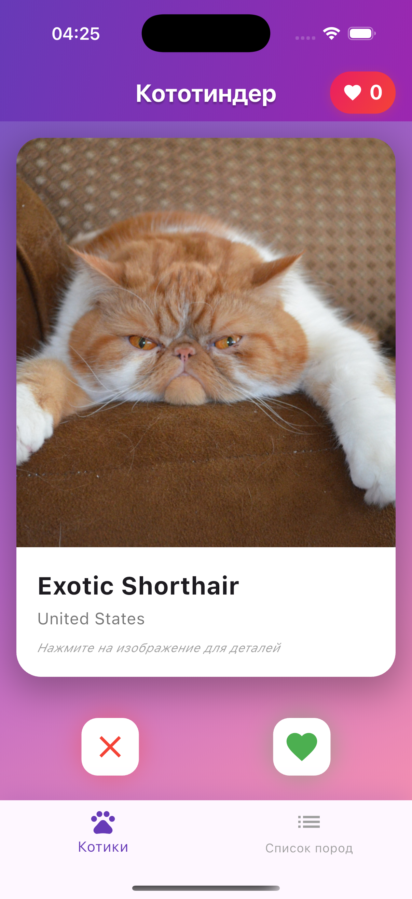
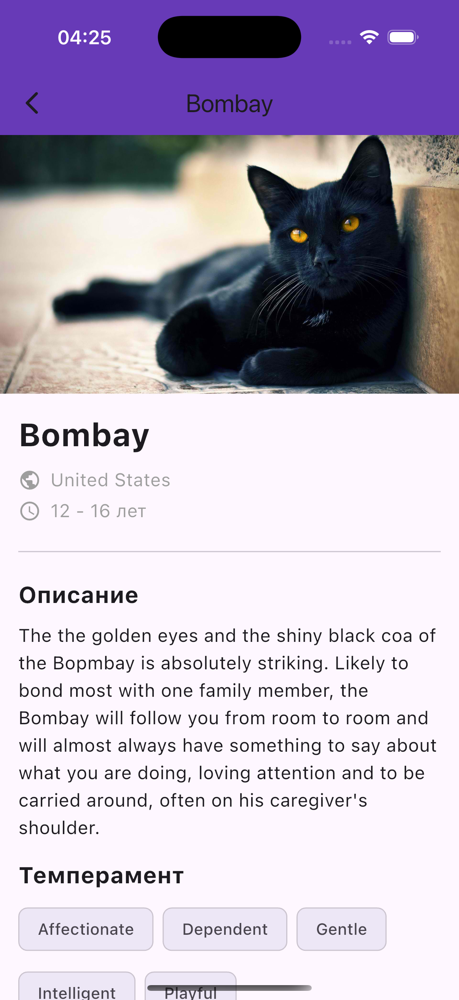
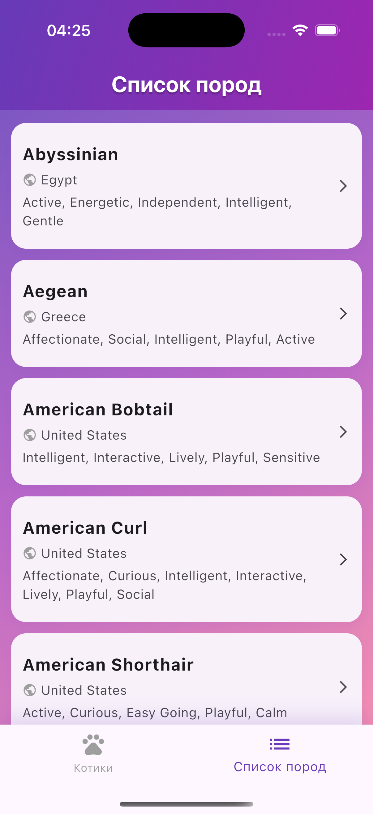

# Кототиндер Про

Flutter приложение для просмотра котиков и изучения пород кошек (ДЗ №2: онбординг, авторизация, Clean Architecture).

## Описание

Приложение в стиле Tinder для просмотра котиков. Онбординг при первом запуске, регистрация и вход с сохранением в keychain, свайп котиков, список пород и детальная информация о породах.

## Реализованные функции

### Онбординг (первый запуск)

- Горизонтальный pager с несколькими шагами
- Шаги: свайп лайк/дизлайк, детали породы, список пород
- Анимация с котиком при смене шагов
- После завершения не показывается повторно

### Регистрация и вход

- Экран входа: email, пароль, валидация
- Экран регистрации: email, пароль, подтверждение пароля
- Пароль хранится в keychain (Flutter Secure Storage)
- Состояние авторизации сохраняется между перезапусками
- Переход на главный экран после успешного входа/регистрации

### Главный экран (Свайп котиков)

- Случайное изображение котика с названием породы
- Свайп влево/вправо или кнопки лайк/дизлайк
- Счетчик лайкнутых котиков
- Тап на изображение открывает детальную информацию
- Плавная анимация смены карточек
- Предзагрузка очереди из 5 котиков

### Экран детального описания породы

- Изображение котика (полноразмерное)
- Информация о породе: название, происхождение, продолжительность жизни
- Описание породы, темперамент в виде чипов
- Характеристики с прогресс-барами

### Экран «Список пород»

- Таб-бар с переключением между экранами
- Список всех пород с краткой информацией
- Тап на породу открывает детальную информацию
- Pull-to-refresh для обновления

## Технические требования

- **Clean Architecture:** Data / Domain / Presentation, бизнес-логика вне UI, централизованный DI (`AppContainer`)
- **API ключ:** передаётся через `--dart-define=CAT_API_KEY=...`, не захардкожен
- **Код:** без bang-операторов, исключения обрабатываются в UI
- **Тесты:** unit-тесты на auth (валидация, signUp/signIn, getCurrentUser), widget-тесты на экраны входа и регистрации
- **CI:** GitHub Actions (flutter analyze, flutter test)

## Установка и запуск

```bash
git clone <repository-url>
cd flutter_hw1
flutter pub get
flutter run
```

**API-ключ (чтобы породы подгружались на экране котиков):** ключ не храните в коде и не коммитьте в GitHub.

1. Скопируйте пример и добавьте свой ключ:
   ```bash
   cp .env.example .env
   # Откройте .env и вставьте ключ: CAT_API_KEY=ваш_ключ
   ```
2. Файл `.env` добавлен в `.gitignore` — он не попадёт в репозиторий.
3. Запуск с ключом из `.env`:
   ```bash
   chmod +x run_with_api_key.sh   # один раз
   ./run_with_api_key.sh
   ```
   Или вручную: `flutter run --dart-define=CAT_API_KEY=ваш_ключ` (ключ в команду не коммитить).

### Сборка APK

```bash
flutter build apk --release
```

APK: `build/app/outputs/flutter-apk/app-release.apk`

## Зависимости

- `http` — запросы к The Cat API
- `cached_network_image` — кэширование изображений
- `flutter_secure_storage` — хранение пароля (keychain)
- `shared_preferences` — флаг онбординга и user id
- `provider` — (опционально) для состояния

## Структура проекта

```
lib/
├── core/
│   ├── config/
│   │   └── env.dart
│   └── di/
│       └── app_container.dart
├── data/
│   ├── datasources/
│   │   ├── auth_local_datasource.dart
│   │   ├── onboarding_local_datasource.dart
│   │   └── cat_remote_datasource.dart
│   └── repositories/
│       ├── auth_repository_impl.dart
│       ├── onboarding_repository_impl.dart
│       └── cat_repository_impl.dart
├── domain/
│   ├── entities/
│   │   └── auth_user.dart
│   └── repositories/
│       ├── auth_repository.dart
│       ├── onboarding_repository.dart
│       └── cat_repository.dart
├── presentation/
│   └── screens/
│       ├── onboarding_screen.dart
│       ├── login_screen.dart
│       └── signup_screen.dart
├── models/
│   ├── breed.dart
│   └── cat_image.dart
├── screens/
│   ├── swipe_screen.dart
│   ├── breed_detail_screen.dart
│   └── breeds_list_screen.dart
├── widgets/
│   └── ...
└── main.dart
```

## Скриншоты

### Онбординг
(Добавьте скриншоты экранов онбординга в папку `screenshots/`)

### Вход / Регистрация
(Добавьте скриншоты экранов входа и регистрации)

### Главный экран


### Детальная информация


### Список пород


## Ссылка на APK

[Скачать APK](https://drive.google.com/uc?export=download&id=1QdPlAqzVTFj4Wv3oUvBogoI_HCw8YXxx)

**Локальная сборка:** `flutter build apk --release` → `build/app/outputs/flutter-apk/app-release.apk`
