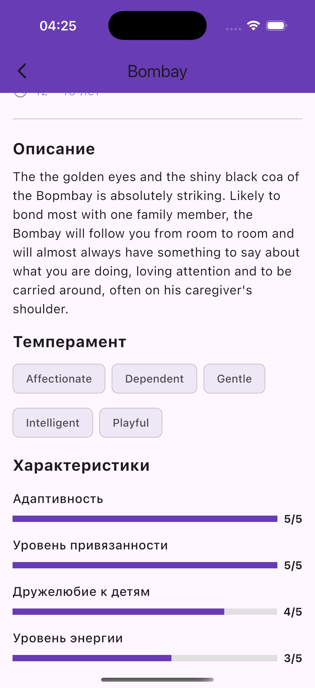

# Кототиндер

Flutter приложение для просмотра котиков и изучения пород кошек.

## Описание

Приложение в стиле Tinder для просмотра котиков. Позволяет свайпать изображения, лайкать понравившихся, изучать информацию о породах и просматривать список всех доступных пород.

## Реализованные функции

### Главный экран (Свайп котиков)

- Случайное изображение котика с названием породы
- Свайп влево/вправо или кнопки лайк/дизлайк
- Счетчик лайкнутых котиков
- Тап на изображение открывает детальную информацию
- Плавная анимация смены карточек
- Предзагрузка очереди из 5 котиков

### Экран детального описания

- Изображение котика (полноразмерное)
- Информация о породе: название, происхождение, продолжительность жизни
- Описание породы
- Темперамент в виде чипов
- 4 характеристики с прогресс-барами: адаптивность, привязанность, дружелюбие к детям, уровень энергии

### Экран "Список пород"

- Таб-бар с переключением между экранами
- Список всех пород с краткой информацией
- Тап на породу открывает детальную информацию
- Pull-to-refresh для обновления

## Технические требования

- Использован пакет `http` для запросов к [The Cat API](https://thecatapi.com)
- Endpoints: `/images/search?has_breeds=1` и `/breeds`
- Использован `CachedNetworkImage` для отображения изображений
- Сетевые ошибки обрабатываются с показом диалогов
- Код отформатирован с помощью `dart format`
- Подключен `flutter_lints`, `flutter analyze` выполняется без ошибок

## Установка и запуск

```bash
git clone <repository-url>
cd flutter_hw1
flutter pub get
flutter run
```

### Сборка APK

```bash
flutter build apk --release
```

APK: `build/app/outputs/flutter-apk/app-release.apk`

## Зависимости

```yaml
dependencies:
  flutter:
    sdk: flutter
  cupertino_icons: ^1.0.8
  http: ^1.2.0
  cached_network_image: ^3.3.1

dev_dependencies:
  flutter_test:
    sdk: flutter
  flutter_lints: ^6.0.0
```

## Структура проекта

```
lib/
├── models/
│   ├── breed.dart
│   └── cat_image.dart
├── screens/
│   ├── swipe_screen.dart
│   ├── breed_detail_screen.dart
│   └── breeds_list_screen.dart
├── services/
│   └── cat_api_service.dart
└── main.dart
```

## Скриншоты

```markdown
### Главный экран


### Детальная информация



### Список пород

```

## Ссылка на APK

```markdown
[Скачать APK](https://drive.google.com/file/d/1QdPlAqzVTFj4Wv3oUvBogoI_HCw8YXxx/view?usp=sharing)
```

**Текущая версия APK:** `build/app/outputs/flutter-apk/app-release.apk` (44 MB)
